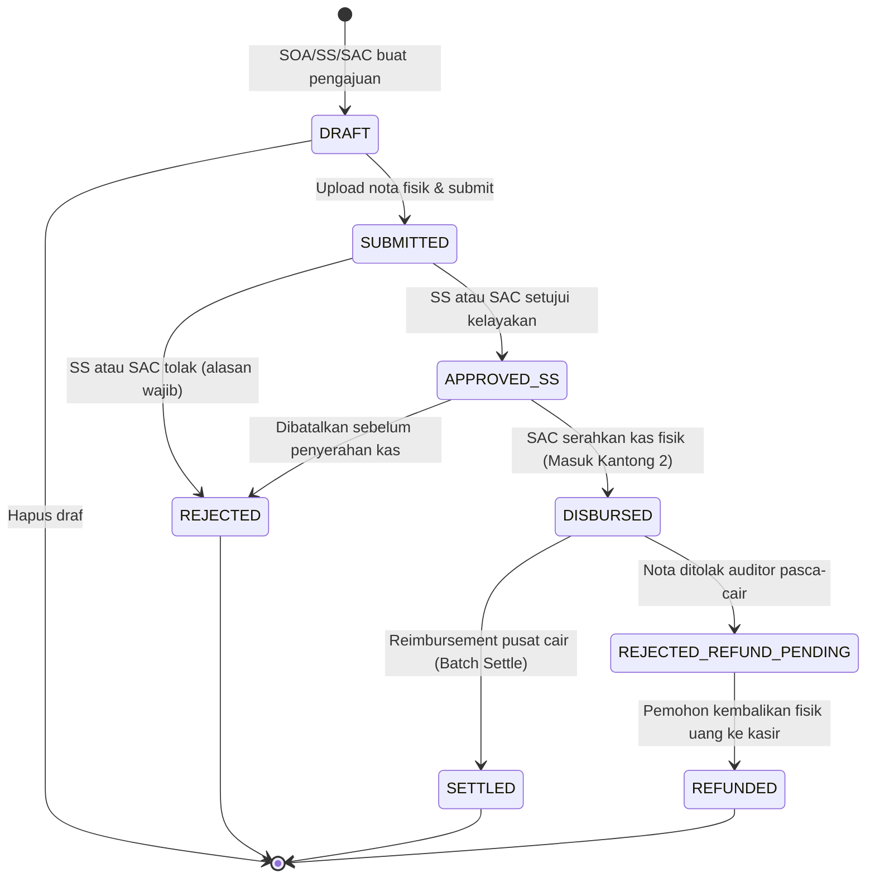
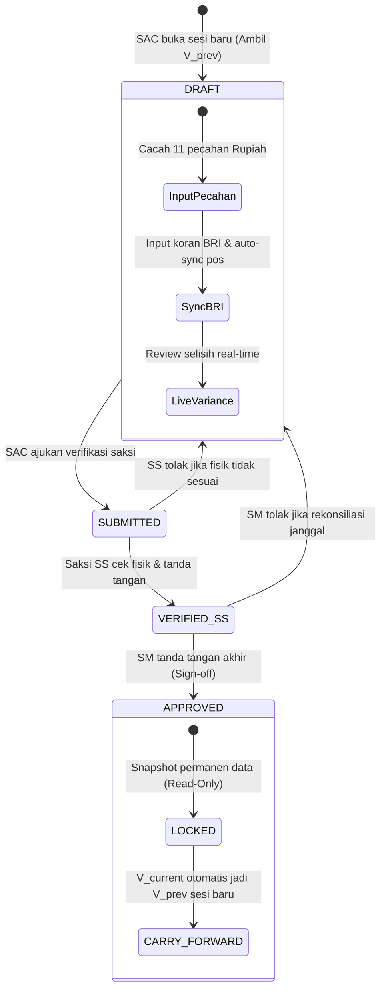
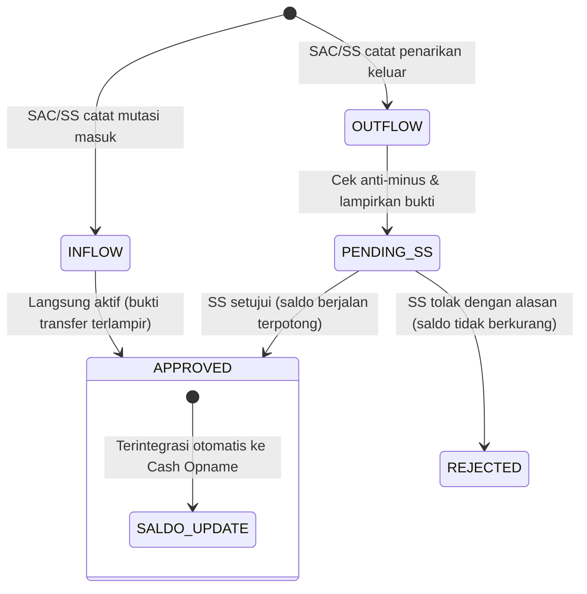

# MASTER SPECIFICATION & TECHNICAL BLUEPRINT: G-COINS
## Gramedia Cash Opname Internal System — Toko Gramedia World Karawang
> **Versi Dokumen:** 2.0.0 (Master Unified Blueprint)  
> **Target Pengguna:** Pengembang Perangkat Lunak, System Architect, Business Analyst, QA Engineer  
> **Tujuan Dokumen:** Spesifikasi menyeluruh (*single source of truth*) yang mencakup logika bisnis, formula akuntansi, matriks wewenang, alur state machine, kamus data basis data, kontrak antarmuka API, hingga arsitektur pelaporan guna keperluan pengembangan ulang (*re-development / porting*) ke tech stack baru tanpa kehilangan konteks maupun integritas sistem.

---

## DAFTAR ISI

1. [Ringkasan Eksekutif & Konteks Bisnis Toko Ritel](#1-ringkasan-eksekutif--konteks-bisnis-toko-ritel)
2. [Konsep Finansial: Sistem Dana Tetap & Model 3 Kantong](#2-konsep-finansial-sistem-dana-tetap--model-3-kantong)
3. [Rekonsiliasi Rekening Pooling Bank BRI & Buku Pembantu Mutasi](#3-rekonsiliasi-rekening-pooling-bank-bri--buku-pembantu-mutasi)
4. [Matriks 11 Pecahan Denominasi Fisik Rupiah](#4-matriks-11-pecahan-denominasi-fisik-rupiah)
5. [Variance Engine & Aturan Carry-Forward Historis](#5-variance-engine--aturan-carry-forward-historis)
6. [Struktur Hak Akses (RBAC) & Segregation of Duties](#6-struktur-hak-akses-rbac--segregation-of-duties)
7. [State Machine & Alur Kerja Bisnis End-to-End](#7-state-machine--alur-kerja-bisnis-end-to-end)
8. [Kamus Data & Model Entitas Basis Data (Data Dictionary)](#8-kamus-data--model-entitas-basis-data-data-dictionary)
9. [Kontrak API, Validasi Input & Kode Kesalahan Standar](#9-kontrak-api-validasi-input--kode-kesalahan-standar)
10. [Pipeline Pengolahan Media & Multi-Lampiran](#10-pipeline-pengolahan-media--multi-lampiran)
11. [Format Berita Acara Resmi & Mesin Spreadsheet Excel (.xlsx)](#11-format-berita-acara-resmi--mesin-spreadsheet-excel-xlsx)
12. [Panduan Arsitektur Pengembangan Ulang (Porting Guidance)](#12-panduan-arsitektur-pengembangan-ulang-porting-guidance)

---

## 1. RINGKASAN EKSEKUTIF & KONTEKS BISNIS TOKO RITEL

### 1.1. Latar Belakang Masalah
Di unit ritel toko buku **Gramedia World Karawang**, pengelolaan kas operasional harian terpusat pada pos **Kas Kecil (Petty Cash)** yang dioperasikan oleh **Staff Administrative Clerk (SAC)** di bawah pengawasan **Store Supervisor (SS)** dan persetujuan **Store Manager (SM)**.

Sebelum sistem G-COINS dibangun, proses verifikasi fisik kas (*cash opname*) dan pengajuan nota belanja dilakukan secara manual menggunakan buku kas fisik dan lembar kerja spreadsheet (Microsoft Excel) yang memiliki kerentanan tinggi:
1. **Risiko Kesalahan Formula & Manipulasi Data:** Input manual ratusan keping koin dan lembar uang rentan salah ketik, formula SUM terhapus, atau file tertimpa.
2. **Rekening Penampung Gabungan (Pooling Account Bank BRI):** Rekening koran operasional BRI toko menampung berbagai dana unit secara bercampur (Kas Kecil, Penjualan B2B sekolah/instansi, Pameran/Event bazar, dan Active Selling). Kasir kesulitan memisahkan porsi murni kas kecil tanpa perhitungan kertas cakar yang rawan salah.
3. **Bon Gantung Tercecer (Unreimbursed Vouchers):** Karyawan toko lintas divisi sering meminjam uang tunai untuk membeli perlengkapan operasional mendesak (misal: lakban packing, konsumsi tamu, token listrik). Nota fisik sering hilang, sobek, atau terlambat di-reimburse ke kantor pusat, menyebabkan selisih kas brankas.
4. **Hilangnya Jejak Riwayat Selisih (Broken Variance Chain):** Jika terjadi selisih lebih (*surplus*) atau selisih kurang (*shortage*) pada periode lalu, angka tersebut sering tidak terbawa secara konsisten ke periode berikutnya saat berganti bulan atau berganti lembar buku kas.

### 1.2. Tujuan Sistem
G-COINS menghadirkan otomasi rekonsiliasi kas berbasis web/PWA yang:
- Mengunci integritas matematis rekonsiliasi 3 kantong kas kecil.
- Mencatat riwayat mutasi rekening bank secara transparan per entitas/mitra.
- Mengompresi bukti nota fisik dari kamera ponsel staf secara instan.
- Menerbitkan dokumen hukum Berita Acara Cash Opname (BACO) berformat resmi Excel (.xlsx) dan siap cetak A4 yang terkunci secara permanen (*immutable*).

---

## 2. KONSEP FINANSIAL: SISTEM DANA TETAP & MODEL 3 KANTONG

### 2.1. Pagu Dana Tetap (Imprest Fund System)
Kas Kecil Gramedia World Karawang menggunakan prinsip **Imprest Fund System** dengan pagu plafon tetap:
$$\text{Plafon Tetap} = \text{Rp5.000.000,00}$$

Artinya, dalam kondisi normal dan seimbang, akumulasi seluruh nilai kas kecil toko pada setiap saat harus bernilai tepat **Rp5.000.000,00**.

### 2.2. Model Distribusi 3 Kantong (Three Pockets Model)
Dana kas kecil terdistribusi ke dalam 3 kantong finansial/fisik:

```
┌────────────────────────────────────────────────────────────────────────┐
│                   PLAFON KAS KECIL: Rp 5.000.000,00                    │
└───────────────────────────────────┬────────────────────────────────────┘
                                    │ Terbagi ke dalam 3 Kantong:
         ┌──────────────────────────┼──────────────────────────┐
         ▼                          ▼                          ▼
┌──────────────────┐       ┌──────────────────┐       ┌──────────────────┐
│    KANTONG 1     │       │    KANTONG 2     │       │    KANTONG 3     │
│  Fisik Brankas   │       │   Bon Gantung    │       │ Porsi Kas Kecil  │
│    (K_fisik)     │       │    (K_bon)       │       │    di Bank BRI   │
│                  │       │                  │       │     (K_bri)      │
│ Lembar & Koin di │       │ Voucher status   │       │ Saldo murni BRI  │
│ brankas kasir    │       │ DISBURSED belum  │       │ setelah dikurangi│
│ dihitung manual  │       │ direimburse      │       │ pos non-kas kecil│
└──────────────────┘       └──────────────────┘       └──────────────────┘
```

1. **Kantong 1 — Fisik Kas Brankas ($K_{\text{fisik}}$):**  
   Uang kartal riil (kertas dan logam Rupiah) yang tersimpan di dalam brankas kasir, dihitung melalui pencacahan 11 pecahan uang standar.
2. **Kantong 2 — Bon Gantung Valid ($K_{\text{bon}}$):**  
   Akumulasi nominal pengajuan kas kecil yang telah dicairkan uang fisiknya oleh SAC ke pemohon (berstatus **`DISBURSED`**), namun dananya belum diganti (*reimbursed*) oleh manajemen kantor pusat.
   $$K_{\text{bon}} = \sum v.\text{amount} \quad \forall v \in \text{Vouchers di mana } v.\text{status} = \text{DISBURSED}$$
3. **Kantong 3 — Porsi Kas Kecil di Rekening BRI ($K_{\text{bri}}$):**  
   Bagian dana kas kecil yang masih tersimpan di rekening koran operasional Bank BRI toko, setelah dikurangi pos-pos dana titipan non-kas kecil.

---

## 3. REKONSILIASI REKENING POOLING BANK BRI & BUKU PEMBANTU MUTASI

### 3.1. Masalah Rekening Penampung (Pooling Account)
Rekening Bank BRI unit toko bukan rekening khusus kas kecil, melainkan **Pooling Account** yang menampung beragam transaksi:
- Kas Operasional / Kas Kecil
- Dana Transaksi B2B (Penjualan korporat, sekolah, pengadaan dinas)
- Dana Kegiatan / Event Pameran (Bazar mall, pameran buku luar toko)
- Dana Active Selling (Aksel)
- Dana Anonim (Transfer masuk dari pihak ketiga/pelanggan yang belum teridentifikasi di mutasi m-banking)
- Pos Kustom Tambahan (Sewa booth bazar, retur vendor, dsb.)

### 3.2. Formula Porsi Bersih Kas Kecil BRI
Untuk mengisolasi porsi Kas Kecil murni dari saldo total mutasi rekening koran, diterapkan rumus:

$$\text{Saldo Kas Kecil}_{\text{BRI}} = S_{\text{mutasi}} - \left( S_{\text{B2B}} + S_{\text{Event}} + S_{\text{Aksel}} + S_{\text{Anonim}} + \sum_{k=1}^{m} S_{\text{kustom}, k} \right)$$

Di mana:
- $S_{\text{mutasi}}$: Saldo mutasi penutupan hari H pada rekening koran resmi Bank BRI.
- Pos pengurang bertindak sebagai saldo berjalan (*rolling sub-ledger balances*) yang nilainya **tidak boleh di-reset ke Rp0** ketika satu sesi cash opname selesai.

### 3.3. Arsitektur Buku Pembantu Mutasi BRI (`BriFundPosting`)
Alih-alih menginput angka saldo pos non-kas kecil secara gelondongan, sistem mengadopsi mekanisme buku pembantu (*sub-ledger postings*):
1. **Mutasi Masuk (`INFLOW`):**
   - Dicatat oleh SAC/SS saat ada transfer masuk (misal: Pelunasan B2B SD Al-Irsyad Rp15.000.000).
   - Wajib unggah bukti transfer/slip koran.
   - Status langsung **`APPROVED`** (langsung menambah saldo berjalan mitra).
2. **Mutasi Penarikan Keluar (`OUTFLOW`):**
   - Dicatat oleh SAC saat dana non-kas kecil ditarik ke rekening toko lain untuk belanja modal proyek/kegiatan.
   - Wajib mencantumkan nominal, rekening tujuan, alasan belanja, dan slip transfer.
   - **Prinsip Dual Control (SS Approval):** Berstatus **`PENDING_SS`**. Saldo berjalan **belum terpotong** sebelum Store Supervisor (SS) atau Store Manager (SM) menyetujuinya menjadi **`APPROVED`**. Jika ditolak (**`REJECTED`**), saldo tidak berubah.
3. **Aturan Anti-Minus (Zero-Deficit Guard):**
   - Sistem secara mutlak memvalidasi:
     $$\text{Nominal Outflow} \le S_{\text{entitas berjalan}}$$
   - Pengajuan penarikan dana keluar yang melebihi sisa saldo berjalan entitas terkait wajib ditolak oleh sistem pada lapisan validasi.
4. **Kalkulasi Saldo Berjalan Entitas:**
   $$S_{e} = \sum \text{Inflow}_{e, \text{APPROVED}} - \sum \text{Outflow}_{e, \text{APPROVED}}$$
   $$S_{\text{kategori}} = \sum_{e \in \text{kategori}} S_{e}$$

### 3.4. Auto-Population ke Sesi Cash Opname
Saat sesi Cash Opname dibuka oleh kasir (SAC):
- Sistem secara otomatis menghitung agregasi saldo berjalan dari seluruh posting berstatus `APPROVED`.
- Nilai diinjeksikan secara instan ke form rekonsiliasi BRI tanpa perlu tombol klik manual (tombol sinkronisasi manual tetap disediakan sebagai fallback).
- Antarmuka menyediakan tombol modal popover breakdown (misal: `[1 Mitra 👁️]`) untuk memeriksa rincian mutasi masuk, keluar, dan saldo per mitra.

---

## 4. MATRIKS 11 PECAHAN DENOMINASI FISIK RUPIAH

Brankas kasir dihitung berdasarkan **11 pecahan resmi Rupiah Bank Indonesia**:

| No | Kelompok | Pecahan Nominal ($N_j$) | Input Kontrol | Tipe Data | Rumus Subtotal ($T_j$) |
| :-: | :--- | :--- | :--- | :---: | :--- |
| 1 | Uang Kertas | Rp 100.000 | Lembar | Integer $\ge 0$ | $C_1 \times 100.000$ |
| 2 | Uang Kertas | Rp 50.000 | Lembar | Integer $\ge 0$ | $C_2 \times 50.000$ |
| 3 | Uang Kertas | Rp 20.000 | Lembar | Integer $\ge 0$ | $C_3 \times 20.000$ |
| 4 | Uang Kertas | Rp 10.000 | Lembar | Integer $\ge 0$ | $C_4 \times 10.000$ |
| 5 | Uang Kertas | Rp 5.000 | Lembar | Integer $\ge 0$ | $C_5 \times 5.000$ |
| 6 | Uang Kertas | Rp 2.000 | Lembar | Integer $\ge 0$ | $C_6 \times 2.000$ |
| 7 | Uang Kertas | Rp 1.000 (Kertas) | Lembar | Integer $\ge 0$ | $C_7 \times 1.000$ |
| 8 | Uang Logam | Rp 1.000 (Koin) | Keping | Integer $\ge 0$ | $C_8 \times 1.000$ |
| 9 | Uang Logam | Rp 500 | Keping | Integer $\ge 0$ | $C_9 \times 500$ |
| 10 | Uang Logam | Rp 200 | Keping | Integer $\ge 0$ | $C_{10} \times 200$ |
| 11 | Uang Logam | Rp 100 | Keping | Integer $\ge 0$ | $C_{11} \times 100$ |

### Rumus Total Kas Fisik Brankas ($K_{\text{fisik}}$):
$$K_{\text{fisik}} = \sum_{j=1}^{11} (C_j \times N_j)$$

**Ketentuan UX Kasir:**
- Input form mendukung navigasi cepat: menekan tombol `[Enter]` atau `[Tab]` pada keyboard numpad PC kasir otomatis berpindah ke pecahan di bawahnya.
- Seluruh 11 pecahan dijamin selalu muncul (auto-heal) pada sisi antarmuka, meskipun record basis data baru saja diinisialisasi.

---

## 5. VARIANCE ENGINE & ATURAN CARRY-FORWARD HISTORIS

### 5.1. Formula Total Kas Riil
$$\text{Total Riil Kas Kecil} = K_{\text{fisik}} + K_{\text{bon}} + K_{\text{bri}}$$

### 5.2. Formula Target Rekonsiliasi & Variance Periode Ini
$$\text{Target Reconciled} = \text{Plafon Imprest (Rp5.000.000)} + V_{\text{prev}}$$
$$V_{\text{current}} = \text{Total Riil Kas Kecil} - \text{Target Reconciled}$$

Di mana:
- $V_{\text{prev}}$: Selisih terkunci dari Berita Acara Cash Opname periode sebelumnya yang berstatus `APPROVED`. Jika belum pernah ada opname sebelumnya, bernilai `0`.
- $V_{\text{current}}$: Selisih kas periode berjalan.

### 5.3. Klasifikasi Status Selisih (Variance Status)
| Nilai $V_{\text{current}}$ | Status | Penjelasan & Tindakan Operasional |
| :---: | :---: | :--- |
| **$= 0$** | **`BALANCED`** | Kas cocok sempurna. Dana dapat dipertanggungjawabkan sepenuhnya. |
| **$> 0$** | **`SURPLUS`** | Fisik kas/bank lebih besar dari perhitungan buku (selisih lebih). Kasir wajib mencari asal kelebihan dana. |
| **$< 0$** | **`SHORTAGE`** | Fisik kas/bank lebih kecil dari perhitungan buku (selisih tekor). Kasir bertanggung jawab mengganti uang tersebut. |

### 5.4. Siklus Penguncian & Carry-Forward Permanen
1. Selama status sesi opname masih `DRAFT`, `SUBMITTED`, atau `VERIFIED_SS`, perhitungan nilai $V_{\text{current}}$ bersifat dinamis (*real-time preview*).
2. Ketika Store Manager (SM) mengeksekusi **Final Sign-off**:
   - Status sesi berubah menjadi **`APPROVED`**.
   - Semua nilai angka ($K_{\text{fisik}}, K_{\text{bon}}, K_{\text{bri}}, V_{\text{current}}$, lembar uang, snapshot sub-ledger) dikunci secara permanen (**Read-Only / Immutable Snapshot**). Tidak ada peran yang dapat mengubah angka ini lagi.
   - Sesi opname berikutnya yang dibuka oleh SAC otomatis membaca nilai $V_{\text{current}}$ dari sesi yang baru disahkan tersebut untuk dijadikan nilai $V_{\text{prev}}$ secara atomik.

### 5.5. Penanganan Kasus Khusus (Edge Cases)
- **Penyelesaian Kas Kurang (Shortage Replacement):** Berita Acara tetap disahkan dengan status `SHORTAGE` sebagai bukti hukum audit. Saat kasir menyetorkan uang ganti rugi ke brankas, uang fisik brankas pada sesi opname periode selanjutnya akan bertambah senilai uang pengganti, menetralkan $V_{\text{prev}}$ negatif menjadi $V_{\text{current}} = 0$ (`BALANCED`).
- **Pembatalan Nota Pasca-Pencairan (Post-Disbursement Cancellation):** Jika suatu voucher berstatus `DISBURSED` ditolak audit pusat: status diubah menjadi `REJECTED_REFUND_PENDING`. Staf wajib mengembalikan uang tunai ke brankas kasir, lalu status diubah menjadi `REFUNDED` (keluar dari $K_{\text{bon}}$).

---

## 6. STRUKTUR HAK AKSES (RBAC) & SEGREGATION OF DUTIES

Sistem mendefinisikan 4 tingkatan peran (*roles*) resmi:

```
[SOA: Staf Toko]  ──(Ajukan Bon)──>  [SS: Supervisor]  ──(Review & Saksi)──>  [SM: Store Manager]
                                             ▲                                          ▲
                                             │                                          │
                                     [SAC: Kasir Toko] ─────────────────────────────────┘
                                     - Pemegang Kas & Brankas
                                     - Pencair Kas Bon (Disburse)
                                     - Operator Input Opname & Mutasi BRI
```

### 6.1. Deskripsi Peran & Tanggung Jawab
1. **SOA (Store Operation Associate):**  
   Staf operasional lantai toko lintas departemen (Buku, Non-Buku, Logistik, Counter).  
   *Wewenang:* Mengajukan bon kas kecil untuk keperluan belanja mendesak dan mengunggah foto nota fisik.
2. **SS (Store Supervisor):**  
   Pengawas operasional lapangan toko, atasan langsung SOA.  
   *Wewenang:* Meninjau dan menyetujui pengajuan bon (*Approval Level 1*), menyetujui penarikan keluar rekening bank BRI (*Dual Control SS*), dan bertindak sebagai saksi fisik penghitungan brankas kasir saat cash opname.
3. **SAC (Staff Administrative Clerk):**  
   Kasir utama dan penanggung jawab administrasi keuangan toko.  
   *Wewenang:* Memegang brankas kas kecil, menyetujui bon rekan kerja (SOA/SS), mencairkan uang tunai bon (*Disburse*), menandai reimbursement selesai (*Batch Settle*), menginput keping uang fisik, mencatat mutasi BRI, dan menyusun Berita Acara.
4. **SM (Store Manager):**  
   Pimpinan tertinggi unit toko Gramedia Karawang.  
   *Wewenang:* Memeriksa hasil rekonsiliasi, meninjau status variance, menandatangani Berita Acara Cash Opname (*Final Sign-off* & penguncian permanen), serta manajemen hak akses pengguna.

### 6.2. Matriks Otorisasi Fitur (Action Permission Matrix)

| Modul & Aksi Operasional | SOA | SS | SAC | SM |
| :--- | :---: | :---: | :---: | :---: |
| **Autentikasi & Akun** | | | | |
| Login via NIK + PIN/Password | ✅ | ✅ | ✅ | ✅ |
| Ganti PIN Akun Sendiri | ✅ | ✅ | ✅ | ✅ |
| Reset PIN Staf Lain (Admin) | ❌ | ❌ | ✅ | ✅ |
| Tambah / Nonaktifkan Akun User | ❌ | ❌ | ✅ | ✅ |
| **Voucher Bon Kas Kecil** | | | | |
| Buat Draf Pengajuan & Upload Nota | ✅ | ✅ | ✅ | ❌ |
| Hapus Draf Bon Milik Sendiri | ✅ | ✅ | ✅ | ❌ |
| Submit Pengajuan untuk Review | ✅ | ✅ | ✅ | ❌ |
| Setujui Pengajuan Bon (SS/SAC Approval) | ❌ | ✅ | ✅* | ✅ |
| Tolak Pengajuan Bon (dengan alasan) | ❌ | ✅ | ✅ | ✅ |
| Serahkan Uang Tunai Kasir (`DISBURSED`) | ❌ | ❌ | ✅ | ❌ |
| Selesaikan Reimbursement (`SETTLED`) | ❌ | ❌ | ✅ | ❌ |
| Batalkan Bon Cair (`REJECTED_REFUND_PENDING`) | ❌ | ❌ | ✅ | ✅ |
| Konfirmasi Pengembalian Uang (`REFUNDED`) | ❌ | ❌ | ✅ | ❌ |
| **Sesi Cash Opname Kasir** | | | | |
| Buka Sesi Cash Opname Baru | ❌ | ❌ | ✅ | ❌ |
| Input / Edit Lembar Pecahan Rupiah | ❌ | ❌ | ✅ | ❌ |
| Input Saldo Koran BRI & Sub-Ledger | ❌ | ❌ | ✅ | ❌ |
| Submit Sesi ke Supervisor (`SUBMITTED`) | ❌ | ❌ | ✅ | ❌ |
| Verifikasi Saksi Fisik Brankas (`VERIFIED_SS`) | ❌ | ✅ | ❌ | ❌ |
| Tolak Sesi Opname Fisik (Kembalikan ke SAC) | ❌ | ✅ | ❌ | ❌ |
| Final Sign-off & Lock Berita Acara (`APPROVED`) | ❌ | ❌ | ❌ | ✅ |
| Batalkan / Tolak Sesi Opname (oleh SM) | ❌ | ❌ | ❌ | ✅ |
| **Buku Pembantu Mutasi Rekening BRI** | | | | |
| Catat Dana Masuk (`INFLOW`) + Bukti | ❌ | ✅ | ✅ | ❌ |
| Catat Penarikan Keluar (`OUTFLOW`) + Bukti | ❌ | ✅ | ✅ | ❌ |
| Setujui Penarikan Keluar (SS Approval Dual-Control) | ❌ | ✅ | ❌** | ✅ |
| Tolak Penarikan Keluar BRI (Reject Outflow) | ❌ | ✅ | ❌ | ✅ |
| Lihat Riwayat Transaksi & Saldo Berjalan | ❌ | ✅ | ✅ | ✅ |
| **Laporan & Dokumen Legal** | | | | |
| Unduh Berita Acara Opname (.xlsx) | ❌ | ✅ | ✅ | ✅ |
| Unduh Rekap Berita Acara Bon JB (.xlsx/PDF) | ❌ | ✅ | ✅ | ✅ |
| Tampilan Cetak Bersih A4 (Print-to-PDF) | ❌ | ✅ | ✅ | ✅ |
| Akses Menu Jejak Audit Sistem (`/audit-logs`) | ❌ | ❌ | ✅ | ✅ |

#### Aturan Khusus Integritas:
- **`*` Larangan Self-Approval SAC:** Kasir (SAC) berwenang menyetujui pengajuan bon milik karyawan lain (SOA/SS). Namun, jika SAC mengajukan bon untuk dirinya sendiri (`requesterId == SAC`), sistem **melarang keras persetujuan mandiri**. Pengajuan tersebut wajib disetujui oleh Store Supervisor (SS) atau Store Manager (SM).
- **`**` Dual Control Penarikan BRI:** Seluruh posting penarikan dana keluar (`OUTFLOW`) dari rekening bank BRI yang dicatat SAC **tidak boleh disetujui sendiri oleh kasir**. Wajib disetujui oleh Store Supervisor (SS) atau Store Manager (SM) sebelum saldo terpotong.

---

## 7. STATE MACHINE & ALUR KERJA BISNIS END-TO-END

### 7.1. State Machine: Lifecycle Voucher Bon Kas Kecil (`PettyCashVoucher`)



**Penjelasan Status Voucher:**
1. `DRAFT`: Form dibuat, nota belum disubmit ke antrean approval.
2. `SUBMITTED`: Muncul di antrean review Supervisor (SS) & Kasir (SAC).
3. `APPROVED_SS`: Disetujui secara operasional, siap dicairkan kasir.
4. `DISBURSED`: **Titik Pengakuan Finansial Kantong 2 ($K_{\text{bon}}$)**. Kasir menyerahkan uang fisik brankas ke staf. Fisik uang berkurang, berganti menjadi lembaran bon gantung aktif.
5. `SETTLED`: Dana pengganti dari kantor pusat telah cair masuk ke kas/bank toko. SAC mengeksekusi batch settlement. Voucher selesai dan tidak lagi menjadi tanggungan kas kecil.
6. `REJECTED`: Ditolak sebelum kas diserahkan, dengan catatan alasan penolakan.
7. `REJECTED_REFUND_PENDING`: Nota bermasalah pasca pencairan, menunggu staf mengembalikan uang fisik ke kasir.
8. `REFUNDED`: Staf telah mengembalikan uang fisik ke kasir secara penuh.

---

### 7.2. State Machine: Lifecycle Sesi Cash Opname (`CashOpnameSession`)



**Penjelasan Siklus Sesi Opname:**
1. `DRAFT`: Sesi dibuka kasir (SAC). Sistem menarik $V_{\text{prev}}$ dari sesi `APPROVED` terakhir dan menginisialisasi 11 pecahan uang bernilai 0. Kasir menghitung fisik brankas, mencocokkan mutasi BRI, dan memantau status variance.
2. `SUBMITTED`: SAC mengunci draf sementara dan memanggil Store Supervisor (SS) ke meja brankas untuk menyaksikan penghitungan fisik.
3. `VERIFIED_SS`: Supervisor memeriksa kesesuaian lembar uang di brankas secara langsung dan menekan tombol verifikasi saksi.
4. `APPROVED`: Store Manager memeriksa rekonsiliasi akhir dan melakukan pengesahan (*sign-off*). Sistem membekukan seluruh data menjadi **Read-Only** dan mencatat $V_{\text{current}}$ sebagai saldo selisih awal periode selanjutnya.

---

### 7.3. State Machine: Lifecycle Buku Pembantu Mutasi BRI (`BriFundPosting`)



---

## 8. KAMUS DATA & MODEL ENTITAS BASIS DATA (DATA DICTIONARY)

### 8.1. Konvensi Tipe Data Finansial
- **Presisi Mata Uang Rupiah:** Wajib menggunakan tipe **`Decimal(15, 2)`** (pada PostgreSQL/MySQL/Prisma) atau `INTEGER` sen di SQLite untuk **menghilangkan kesalahan pembulatan angka biner mengambang (*zero floating-point error*)**.
- **Primary Key:** Menggunakan format string alfanumerik `CUID` (atau `UUIDv7`) yang tahan tabrakan (*collision-resistant*) dan terurut berdasarkan waktu pembuatan.
- **Zona Waktu:** Disimpan dalam basis data berformat UTC (ISO-8601) dan disajikan ke pengguna dalam format Waktu Indonesia Barat (**WIB / UTC+7**).

---

### 8.2. Rincian Skema Tabel

#### Tabel: `users`
| Kolom | Tipe Data | Nullable | Default | Deskripsi & Aturan |
| :--- | :--- | :---: | :---: | :--- |
| `id` | VARCHAR(32) | NO | CUID | Primary Key. |
| `nik` | VARCHAR(20) | NO | - | Nomor Induk Karyawan Gramedia. **UNIQUE**. |
| `name` | VARCHAR(100) | NO | - | Nama lengkap karyawan toko. |
| `role` | ENUM | NO | `SOA` | Pilihan: `SOA`, `SS`, `SAC`, `SM`. |
| `pinHash` | VARCHAR(255) | NO | - | Hash kriptografi (Argon2id atau bcrypt) dari 6-digit PIN/Password. |
| `phoneNumber` | VARCHAR(20) | YES | NULL | Nomor kontak WhatsApp aktif. |
| `isActive` | BOOLEAN | NO | `TRUE` | Status keaktifan akun. |
| `createdAt` | DATETIME | NO | NOW() | Waktu registrasi akun. |
| `updatedAt` | DATETIME | NO | NOW() | Waktu modifikasi akun. |

#### Tabel: `cash_opname_sessions`
| Kolom | Tipe Data | Nullable | Default | Deskripsi & Aturan |
| :--- | :--- | :---: | :---: | :--- |
| `id` | VARCHAR(32) | NO | CUID | Primary Key. |
| `opnameNumber` | VARCHAR(30) | NO | - | Nomor Berita Acara: `CO-KK-YYYYMM-XXXX`. **UNIQUE**. |
| `opnameType` | ENUM | NO | `KAS_KECIL` | Pilihan: `KAS_KECIL`, `KAS_BESAR`, `ACTIVE_SELLING`, `MATERAI`, `VOUCHER`. |
| `status` | ENUM | NO | `DRAFT` | Pilihan: `DRAFT`, `SUBMITTED`, `VERIFIED_SS`, `APPROVED`, `REJECTED`. |
| `date` | DATETIME | NO | NOW() | Tanggal pelaksanaan opname. |
| `imprestFund` | DECIMAL(15,2) | NO | `5000000.00` | Pagu plafon tetap kas kecil toko. |
| `previousVariance` | DECIMAL(15,2) | NO | `0.00` | Selisih terkunci periode sebelumnya ($V_{\text{prev}}$). |
| `physicalTotal` | DECIMAL(15,2) | NO | `0.00` | Akumulasi kas fisik brankas ($K_{\text{fisik}}$). |
| `vouchersTotal` | DECIMAL(15,2) | NO | `0.00` | Akumulasi bon gantung aktif ($K_{\text{bon}}$). |
| `briCleanBalance`| DECIMAL(15,2) | NO | `0.00` | Porsi bersih kas kecil di BRI ($K_{\text{bri}}$). |
| `totalActual` | DECIMAL(15,2) | NO | `0.00` | $K_{\text{fisik}} + K_{\text{bon}} + K_{\text{bri}}$. |
| `targetReconciled`| DECIMAL(15,2) | NO | `5000000.00`| $\text{imprestFund} + \text{previousVariance}$. |
| `currentVariance` | DECIMAL(15,2) | NO | `0.00` | $\text{totalActual} - \text{targetReconciled}$ ($V_{\text{current}}$). |
| `varianceStatus` | ENUM | NO | `BALANCED` | Pilihan: `BALANCED`, `SURPLUS`, `SHORTAGE`. |
| `createdById` | VARCHAR(32) | NO | - | FK merujuk ke `users.id` (SAC pembuat sesi). |
| `verifiedBySSId` | VARCHAR(32) | YES | NULL | FK merujuk ke `users.id` (Store Supervisor saksi). |
| `approvedBySMId` | VARCHAR(32) | YES | NULL | FK merujuk ke `users.id` (Store Manager sign-off). |
| `verifiedSSAt` | DATETIME | YES | NULL | Stempel waktu verifikasi saksi SS. |
| `approvedSMAt` | DATETIME | YES | NULL | Stempel waktu persetujuan final SM (memicu lock). |
| `generatedExcelUrl`| VARCHAR(255)| YES | NULL | Path arsip berkas Excel (.xlsx) resmi hasil generate. |
| `generatedPdfUrl` | VARCHAR(255) | YES | NULL | Path arsip berkas PDF Berita Acara siap cetak. |
| `signedBaScanUrl` | VARCHAR(255) | YES | NULL | Path foto scan Berita Acara bertanda tangan basah 3 pihak. |
| `notes` | TEXT | YES | NULL | Catatan kejadian operasional atau temuan fisik brankas. |
| `createdAt` | DATETIME | NO | NOW() | Stempel waktu pembuatan. |
| `updatedAt` | DATETIME | NO | NOW() | Stempel waktu pembaruan. |

#### Tabel: `denomination_details`
| Kolom | Tipe Data | Nullable | Default | Deskripsi & Aturan |
| :--- | :--- | :---: | :---: | :--- |
| `id` | VARCHAR(32) | NO | CUID | Primary Key. |
| `sessionId` | VARCHAR(32) | NO | - | FK merujuk ke `cash_opname_sessions.id` (ON DELETE CASCADE). |
| `nominal` | INTEGER | NO | - | Nilai pecahan: 100000, 50000, 20000, 10000, 5000, 2000, 1000, 500, 200, 100. |
| `isCoin` | BOOLEAN | NO | `FALSE` | `TRUE` untuk uang logam, `FALSE` untuk uang kertas. |
| `count` | INTEGER | NO | `0` | Jumlah lembar atau keping fisik ($C_j \ge 0$). |
| `subtotal` | DECIMAL(15,2) | NO | `0.00` | Hasil perkalian `count` $\times$ `nominal`. |

#### Tabel: `bri_sub_ledgers`
| Kolom | Tipe Data | Nullable | Default | Deskripsi & Aturan |
| :--- | :--- | :---: | :---: | :--- |
| `id` | VARCHAR(32) | NO | CUID | Primary Key. |
| `sessionId` | VARCHAR(32) | NO | - | FK merujuk ke `cash_opname_sessions.id` (ON DELETE CASCADE). **UNIQUE**. |
| `briMutationTotal`| DECIMAL(15,2) | NO | - | Saldo mutasi terakhir pada rekening koran BRI. |
| `b2bAllocation` | DECIMAL(15,2) | NO | `0.00` | Saldo berjalan alokasi transaksi B2B. |
| `eventAllocation` | DECIMAL(15,2) | NO | `0.00` | Saldo berjalan alokasi pameran / event bazar. |
| `akselAllocation` | DECIMAL(15,2) | NO | `0.00` | Saldo berjalan alokasi Active Selling. |
| `anonymousAllocation`| DECIMAL(15,2)| NO | `0.00` | Saldo transfer masuk yang belum teridentifikasi. |
| `customAllocationsTotal`| DECIMAL(15,2)| NO| `0.00` | Akumulasi pos-pos kustom tambahan. |
| `statementProofUrl`| VARCHAR(255)| YES | NULL | Path foto scan rekening koran atau screenshot m-banking BRI. |
| `netKasKecilBri` | DECIMAL(15,2) | NO | `0.00` | `briMutationTotal` dikurangi seluruh pos non-kas kecil. |
| `createdAt` | DATETIME | NO | NOW() | Waktu pencatatan rekonsiliasi. |

#### Tabel: `bri_custom_allocations`
| Kolom | Tipe Data | Nullable | Default | Deskripsi & Aturan |
| :--- | :--- | :---: | :---: | :--- |
| `id` | VARCHAR(32) | NO | CUID | Primary Key. |
| `subLedgerId` | VARCHAR(32) | NO | - | FK merujuk ke `bri_sub_ledgers.id` (ON DELETE CASCADE). |
| `name` | VARCHAR(100) | NO | - | Nama pos dana kustom (contoh: "Sewa Booth Bazar"). |
| `amount` | DECIMAL(15,2) | NO | `0.00` | Saldo dana untuk pos ini ($\ge 0$). |
| `notes` | VARCHAR(255) | YES | NULL | Catatan peruntukan pos. |
| `proofAttachmentUrl`| VARCHAR(255)| YES | NULL | Path foto slip/bukti transaksi pos kustom. |
| `createdAt` | DATETIME | NO | NOW() | Waktu pembuatan pos. |

#### Tabel: `bri_fund_postings`
| Kolom | Tipe Data | Nullable | Default | Deskripsi & Aturan |
| :--- | :--- | :---: | :---: | :--- |
| `id` | VARCHAR(32) | NO | CUID | Primary Key. |
| `category` | ENUM | NO | - | Pilihan: `B2B`, `EVENT`, `AKSEL`, `ANONYMOUS`, `CUSTOM`. |
| `customCategoryName`| VARCHAR(100)| YES | NULL | Nama pos jika `category == CUSTOM`. |
| `entityName` | VARCHAR(150) | NO | - | Nama mitra / kegiatan (misal: "SD Al-Irsyad", "Bazar Resinda"). |
| `type` | ENUM | NO | - | Pilihan: `INFLOW` (Dana Masuk) atau `OUTFLOW` (Penarikan Keluar). |
| `amount` | DECIMAL(15,2) | NO | - | Nominal mutasi ($> 0$). |
| `purpose` | VARCHAR(255) | NO | - | Keterangan mutasi / rekening toko tujuan belanja operasional. |
| `proofAttachmentUrl`| VARCHAR(255)| YES | NULL | Path foto bukti transfer atau slip koran bank. |
| `status` | ENUM | NO | `APPROVED` (Inflow)<br>`PENDING_SS` (Outflow) | Status wewenang: `PENDING_SS`, `APPROVED`, `REJECTED`. |
| `createdById` | VARCHAR(32) | NO | - | FK merujuk ke `users.id` kasir pembuat posting. |
| `approvedBySSId` | VARCHAR(32) | YES | NULL | FK merujuk ke `users.id` Supervisor penyetuju penarikan. |
| `approvedSSAt` | DATETIME | YES | NULL | Stempel waktu persetujuan supervisor. |
| `rejectionReason`| VARCHAR(255)| YES | NULL | Catatan alasan penolakan jika ditolak supervisor. |
| `createdAt` | DATETIME | NO | NOW() | Waktu pencatatan mutasi transaksi. |
| `updatedAt` | DATETIME | NO | NOW() | Waktu modifikasi posting. |

#### Tabel: `petty_cash_vouchers`
| Kolom | Tipe Data | Nullable | Default | Deskripsi & Aturan |
| :--- | :--- | :---: | :---: | :--- |
| `id` | VARCHAR(32) | NO | CUID | Primary Key. |
| `voucherNumber` | VARCHAR(30) | NO | - | Nomor bon: `PCV-YYYYMM-XXXX`. **UNIQUE**. |
| `requesterId` | VARCHAR(32) | NO | - | FK merujuk ke `users.id` (Staf pemohon). |
| `amount` | DECIMAL(15,2) | NO | - | Nominal pengajuan ($> 0$, maks Rp5.000.000). |
| `purpose` | VARCHAR(255) | NO | - | Keperluan belanja operasional mendesak. |
| `category` | ENUM | NO | `OPERASIONAL` | Pilihan: `OPERASIONAL`, `STRUK_KASIR`, `LOGISTIK`, `KONSUMSI`, `MAINTENANCE`, `LAINNYA`. |
| `status` | ENUM | NO | `DRAFT` | Pilihan: `DRAFT`, `SUBMITTED`, `APPROVED_SS`, `DISBURSED`, `SETTLED`, `REJECTED`, `REJECTED_REFUND_PENDING`, `REFUNDED`. |
| `receiptImageUrl`| VARCHAR(255)| YES | NULL | Path foto struk / kuitansi fisik (WebP terkompresi). |
| `itemPhotoUrl` | VARCHAR(255) | YES | NULL | Path foto fisik barang belanjaan / serah terima bon JB (WebP). |
| `approvedBySSId` | VARCHAR(32) | YES | NULL | FK merujuk ke `users.id` (Supervisor / SAC penyetuju kelayakan). |
| `disbursedById` | VARCHAR(32) | YES | NULL | FK merujuk ke `users.id` (SAC yang menyerahkan uang kas). |
| `disbursedAt` | DATETIME | YES | NULL | Stempel waktu uang kas diserahkan (mulai jadi Kantong 2). |
| `settledAt` | DATETIME | YES | NULL | Stempel waktu reimbursement diganti oleh pusat. |
| `rejectionReason`| VARCHAR(255)| YES | NULL | Alasan penolakan jika status = `REJECTED`. |
| `createdAt` | DATETIME | NO | NOW() | Waktu pembuatan pengajuan. |
| `updatedAt` | DATETIME | NO | NOW() | Waktu perubahan status. |

#### Tabel: `audit_logs`
| Kolom | Tipe Data | Nullable | Default | Deskripsi & Aturan |
| :--- | :--- | :---: | :---: | :--- |
| `id` | VARCHAR(32) | NO | CUID | Primary Key. |
| `entityName` | VARCHAR(50) | NO | - | Entitas sasaran: `CashOpnameSession`, `PettyCashVoucher`, `BriFundPosting`, `User`. |
| `entityId` | VARCHAR(32) | NO | - | ID record entitas target. |
| `action` | VARCHAR(50) | NO | - | Aksi audit: `LOGIN`, `DISBURSE`, `SIGN_OFF_SM`, `SETTLE_BATCH`, `REJECT_VOUCHER`, `APPROVE_OUTFLOW`. |
| `performedById` | VARCHAR(32) | NO | - | FK merujuk ke `users.id` aktor pelaksana. |
| `oldValues` | TEXT (JSON) | YES | NULL | Snapshot data sebelum mutasi dalam format JSON string. |
| `newValues` | TEXT (JSON) | YES | NULL | Snapshot data sesudah mutasi dalam format JSON string. |
| `ipAddress` | VARCHAR(45) | YES | NULL | Alamat IP pemanggil (IPv4 / IPv6). |
| `createdAt` | DATETIME | NO | NOW() | Waktu peristiwa audit dicatat. |

#### Tabel: `attachments`
| Kolom | Tipe Data | Nullable | Default | Deskripsi & Aturan |
| :--- | :--- | :---: | :---: | :--- |
| `id` | VARCHAR(32) | NO | CUID | Primary Key. |
| `entityType` | ENUM | NO | - | Pilihan: `VOUCHER`, `CASH_OPNAME_SESSION`, `BRI_SUB_LEDGER`, `BRI_CUSTOM_ALLOCATION`, `BRI_FUND_POSTING`. |
| `entityId` | VARCHAR(32) | NO | - | ID baris record entitas induk. |
| `category` | ENUM | NO | - | Pilihan: `RECEIPT_PHOTO`, `ITEM_PHOTO`, `BANK_STATEMENT`, `CUSTOM_ALLOC_PROOF`, `BRI_POSTING_PROOF`, `EXCEL_EXPORT`, `PDF_REPORT`, `SIGNED_BA_SCAN`. |
| `fileName` | VARCHAR(255) | NO | - | Nama asli berkas saat diunggah (misal: `Struk_Lakban.jpg`). |
| `filePath` | VARCHAR(255) | NO | - | Path berkas di media disk server. |
| `fileSizeBytes`| INTEGER | NO | - | Ukuran berkas terkompresi dalam satuan byte. |
| `mimeType` | VARCHAR(100) | NO | - | Tipe MIME (`image/webp`, `application/pdf`, `.xlsx`). |
| `uploadedById` | VARCHAR(32) | NO | - | FK merujuk ke `users.id` (pengunggah berkas). |
| `createdAt` | DATETIME | NO | NOW() | Waktu pengunggahan berkas. |

---

## 9. KONTRAK API, VALIDASI INPUT & KODE KESALAHAN STANDAR

### 9.1. Format Respons Terpadu (Unified API Response)
Seluruh API endpoints dan RPC / Server Actions mengembalikan struktur data seragam:

```json
// Respons Berhasil:
{
  "success": true,
  "data": { ... }
}

// Respons Gagal:
{
  "success": false,
  "error": {
    "code": "VALIDATION_FAILED",
    "message": "Nominal pengeluaran tidak boleh melebihi plafon Rp 5.000.000",
    "details": { ... }
  }
}
```

### 9.2. Daftar Kode Kesalahan Standar (Standard Error Codes)
- `UNAUTHENTICATED`: Pengguna belum login atau token sesi kedaluwarsa.
- `FORBIDDEN_ROLE`: Pengguna tidak memiliki wewenang untuk mengeksekusi aksi ini.
- `FORBIDDEN_SELF_APPROVAL`: Kasir (SAC) dilarang menyetujui pengajuan bon milik dirinya sendiri.
- `VALIDATION_FAILED`: Input form tidak memenuhi skema validasi.
- `SESSION_LOCKED`: Sesi cash opname telah disahkan oleh Store Manager dan berstatus read-only.
- `VOUCHER_INVALID_STATE`: Status voucher tidak mengizinkan transisi yang diminta.
- `INSUFFICIENT_RUNNING_BALANCE`: Nominal penarikan keluar BRI melebihi saldo berjalan entitas terkait.
- `NOT_FOUND`: Data rekaman tidak ditemukan di basis data.

---

### 9.3. Spesifikasi Endpoint & Service Contracts

#### A. Autentikasi & Pengguna
1. `POST /api/auth/login`
   - **Payload:** `{ "nik": "2024001", "pin": "123456" }`
   - **Logika:** Verifikasi NIK aktif, bandingkan PIN dengan `pinHash` (Argon2id/bcrypt), terbitkan Cookie sesi HTTP-Only yang ditandatangani HMAC SHA-256.
2. `POST /api/auth/logout`
   - **Logika:** Hapus cookie sesi dari browser klien.
3. `GET /api/auth/me`
   - **Logika:** Mengembalikan data sesi pengguna aktif (`id, nik, name, role`).
4. `POST /api/users/change-pin`
   - **Payload:** `{ "currentPin": "123456", "newPin": "654321" }`
5. `POST /api/users` (Khusus SAC & SM)
   - **Payload:** `{ "nik": "2026099", "name": "Budi Santoso", "role": "SOA", "initialPin": "123456", "phoneNumber": "0812..." }`

#### B. Pengajuan Bon Kas Kecil (`PettyCashVoucher`)
1. `POST /api/vouchers` (Role: SOA, SS, SAC)
   - **Payload:**
     ```json
     {
       "amount": 50000,
       "purpose": "Beli lakban bening dan tali rafia packing buku",
       "category": "LOGISTIK",
       "receiptImageUrl": "/uploads/vouchers/2026/09/PCV-001-receipt.webp",
       "itemPhotoUrl": "/uploads/vouchers/2026/09/PCV-001-item.webp"
     }
     ```
   - **Logika:** Buat voucher dengan status `DRAFT` atau `SUBMITTED`, generate nomor unik `PCV-YYYYMM-XXXX`.
2. `POST /api/vouchers/:id/approve` (Role: SS, SAC, SM)
   - **Validasi:** Tolak jika `voucher.requesterId == currentUser.id && currentUser.role == SAC` (Anti Self-Approval).
   - **Logika:** Ubah status menjadi `APPROVED_SS`.
3. `POST /api/vouchers/:id/reject` (Role: SS, SAC, SM)
   - **Payload:** `{ "reason": "Nota tidak jelas / bukan pengeluaran operasional toko" }`
   - **Logika:** Ubah status menjadi `REJECTED`.
4. `POST /api/vouchers/:id/disburse` (Role: SAC)
   - **Logika:** Kasir menyerahkan kas fisik. Ubah status menjadi `DISBURSED`, catat `disbursedById` dan `disbursedAt`. Voucher resmi menjadi **Bon Gantung Aktif ($K_{\text{bon}}$)**.
5. `POST /api/vouchers/batch-settle` (Role: SAC)
   - **Payload:** `{ "voucherIds": ["cuid1", "cuid2"] }`
   - **Logika:** Mengubah status sekumpulan voucher terpilih menjadi `SETTLED`.

#### C. Sesi Cash Opname Kasir (`CashOpnameSession`)
1. `POST /api/opname/start` (Role: SAC)
   - **Logika:** Periksa jika ada draf aktif (lanjutkan jika ada). Jika tidak, buat sesi baru: generate `CO-KK-YYYYMM-XXXX`, ambil $V_{\text{current}}$ dari sesi `APPROVED` terakhir sebagai $V_{\text{prev}}$, inisialisasi 11 pecahan bernilai 0, dan auto-populate saldo berjalan mutasi BRI yang aktif (`APPROVED`).
2. `GET /api/opname/:id` (Role: SAC, SS, SM)
   - **Logika:** Mengembalikan detail sesi, 11 pecahan (dengan auto-heal jika baris kurang), sub-ledger BRI, dan seluruh bon gantung yang aktif saat itu.
3. `PUT /api/opname/:id/denominations` (Role: SAC)
   - **Payload:** Array 11 pecahan `{ nominal: number, count: number, isCoin: boolean }`.
   - **Logika:** Simpan hitungan fisik dan perbarui $K_{\text{fisik}} = \sum (\text{count} \times \text{nominal})$.
4. `PUT /api/opname/:id/bri-subledger` (Role: SAC)
   - **Payload:** Saldo mutasi BRI, alokasi pos standar, dan pos kustom.
   - **Logika:** Hitung $K_{\text{bri}} = S_{\text{mutasi}} - \sum \text{Pos Non-Kas}$.
5. `POST /api/opname/:id/submit` (Role: SAC)
   - **Logika:** Kunci draf awal kasir, ubah status menjadi `SUBMITTED` untuk meminta kehadiran saksi SS.
6. `POST /api/opname/:id/verify-ss` (Role: SS)
   - **Logika:** Store Supervisor menyaksikan fisik brankas secara langsung dan mengesahkan kehadiran: ubah status menjadi `VERIFIED_SS`, simpan `verifiedBySSId` dan `verifiedSSAt`.
7. `POST /api/opname/:id/sign-off` (Role: SM)
   - **Payload:** `{ "notes": "Kas sesuai, disetujui", "confirmUnderstanding": true }`
   - **Logika:** Store Manager menandatangani BACO. Ubah status menjadi `APPROVED`, bekukan seluruh data menjadi **Immutable Read-Only Snapshot**, catat `approvedSMAt`.

#### D. Buku Pembantu Mutasi BRI (`BriFundPosting`)
1. `POST /api/bri-postings` (Role: SAC, SS)
   - **Payload:**
     ```json
     {
       "category": "B2B",
       "entityName": "SD Al-Irsyad",
       "type": "OUTFLOW",
       "amount": 3000000,
       "purpose": "Transfer belanja buku kurikulum ke Toko X",
       "proofAttachmentUrl": "/uploads/bank_proofs/2026/09/slip-outflow-001.webp"
     }
     ```
   - **Logika:**
     - Jika `INFLOW`: Set status `APPROVED` (langsung menambah saldo berjalan mitra).
     - Jika `OUTFLOW`: Validasi anti-minus ($S_{e} - \text{amount} \ge 0$). Jika lolos, set status `PENDING_SS`.
2. `POST /api/bri-postings/:id/approve` (Role: SS, SM)
   - **Logika:** Supervisor/Manager menyetujui penarikan keluar (`OUTFLOW`). Ubah status menjadi `APPROVED`, saldo berjalan resmi terpotong.
3. `POST /api/bri-postings/:id/reject` (Role: SS, SM)
   - **Payload:** `{ "reason": "Rekening tujuan tidak sesuai proposal" }`
   - **Logika:** Ubah status menjadi `REJECTED`, saldo berjalan tidak berkurang.
4. `GET /api/bri-postings/balances` (Role: SAC, SS, SM)
   - **Logika:** Mengembalikan agregasi saldo berjalan aktif per pos (`b2b, event, aksel, anonymous, customTotal`) dan breakdown per entitas mitra.

---

## 10. PIPELINE PENGOLAHAN MEDIA & MULTI-LAMPIRAN

### 10.1. Kompresi Sisi Klien (Client-Side Compression)
Foto asli kamera ponsel pintar modern menghasilkan berkas berukuran **4 MB s/d 12 MB**. Mengunggah berkas mentah ini akan membebani bandwidth toko dan kapasitas server VPS.

**Spesifikasi Pipeline Kompresi Browser:**
1. File dibaca melalui Canvas API (`OffscreenCanvas` / `HTMLCanvasElement`).
2. Dimensi foto diskalakan secara proporsional dengan batasan maksimum:
   - Lebar Maksimum: **1280 piksel**
   - Tinggi Maksimum: **1920 piksel**
3. Dikonversi ke format berkas **WebP** dengan kualitas kompresi **0.75 (75%)**.
4. **Hasil Kompresi:** Ukuran berkas terpangkas menjadi **120 KB – 250 KB** (reduksi >95%) dengan teks kwitansi, nominal rupiah, stempel kasir, dan tanda tangan tetap tajam (*crisp & legible*).
5. Batas maksimal payload upload pada server reverse proxy (Nginx): **2 MB**.

### 10.2. Sistem Multi-Lampiran Dokumen (`attachments`)
Sistem mendukung multi-lampiran dokumen pendukung secara fleksibel:
- **Bon JB (Bukti Pengeluaran Kas Kecil):** Dapat melampirkan 2 foto sekaligus:
  1. `RECEIPT_PHOTO`: Foto struk kasir / kuitansi pembelian.
  2. `ITEM_PHOTO`: Foto fisik barang yang dibeli atau bukti serah terima fisik.
- **Mutasi Bank BRI:** Melampirkan `BANK_STATEMENT` (scan koran bank) atau `BRI_POSTING_PROOF` (slip transfer masuk/keluar).
- **Arsip Berita Acara Legal:** Melampirkan `EXCEL_EXPORT` (.xlsx), `PDF_REPORT` (dokumen cetak), dan `SIGNED_BA_SCAN` (foto hasil pindai dokumen fisik yang telah ditandatangani basah oleh SAC, SS, dan SM).

---

## 11. FORMAT BERITA ACARA RESMI & MESIN SPREADSHEET EXCEL (.XLSX)

Sistem menyediakan ekspor spreadsheet resmi menggunakan pustaka spreadsheet generator (seperti `exceljs` atau pustaka serupa di bahasa lain).

### 11.1. Tata Letak Berita Acara Cash Opname (BACO)
Format lembar kerja Excel dibuat dengan struktur koordinat resmi:

```
====================================================================================================
KOLOM:  A        B                    C                  D                  E                  F
====================================================================================================
Baris 1: [LOGO]  PT GRAMEDIA ASRI MEDIA - TOKO GRAMEDIA WORLD KARAWANG
Baris 2:         BERITA ACARA CASH OPNAME KAS KECIL (PETTY CASH)
Baris 3:         No. Dokumen: [CO-KK-202609-0001]           Tanggal Opname: [17 September 2026]
Baris 4:         Waktu Mulai: [21:00 WIB]                   Waktu Selesai:  [21:30 WIB]
Baris 5: -------------------------------------------------------------------------------------------
Baris 6: I. RINCIAN FISIK UANG KAS (BRANKAS KASIR)
Baris 7: No.     Kelompok             Pecahan (Rp)       Jumlah Lembar/Keping                 Total (Rp)
Baris 8: 1       Uang Kertas          Rp 100.000         15                         =C8*D8   1.500.000
Baris 9: 2       Uang Kertas          Rp  50.000         12                         =C9*D9     600.000
... (seluruh 11 pecahan) ...
Baris 18: 11     Uang Logam           Rp     100          0                         =C18*D18         0
Baris 19:        TOTAL FISIK KAS BRANKAS                                            =SUM(E8:E18)
Baris 20: ------------------------------------------------------------------------------------------
Baris 21: II. RINCIAN BON GANTUNG VALID (UNREIMBURSED VOUCHERS)
Baris 22: No.    No. Voucher          Nama Requester     Keperluan Pengeluaran               Jumlah (Rp)
Baris 23: 1      PCV-202609-001       Budi Santoso       Beli lakban packing                    50.000
Baris 24: 2      PCV-202609-002       Dewi Lestari       Konsumsi tamu vendor                1.500.000
Baris 25:        TOTAL BON GANTUNG                                                  =SUM(E23:E24)
Baris 26: ------------------------------------------------------------------------------------------
Baris 27: III. REKONSILIASI REKENING OPERASIONAL BANK BRI (SUB-LEDGER)
Baris 28: Keterangan Pos Transaksi                                                  Jumlah (Rp)
Baris 29: Saldo Mutasi Terkini Rekening Koran BRI                                            4.250.000
Baris 30: Dikurangi Pos Non-Kas Kecil (Rolling Balances):
Baris 31: - Alokasi Dana B2B (Sekolah & Instansi)                                           (1.000.000)
Baris 32: - Alokasi Dana Event & Pameran                                                    (1.250.000)
Baris 33: - Alokasi Dana Active Selling (Aksel)                                               (500.000)
Baris 34: - Dana Anonim (Transfer Belum Teridentifikasi)                                      (300.000)
Baris 35: - Pos Kustom Lainnya (misal: Sewa Booth Bazar)                                      (200.000)
Baris 36: SALDO BERSIH KAS KECIL DI BANK BRI                                        =E29-SUM(E31:E35)
Baris 37: ------------------------------------------------------------------------------------------
Baris 38: IV. REKAPITULASI & PENENTUAN SELISIH (VARIANCE)
Baris 39: A. TOTAL KAS KECIL RIIL (Fisik + Bon Gantung + BRI)                       =E19+E25+E36
Baris 40: B. Plafon Imprest Kas Kecil Toko                                                   5.000.000
Baris 41: C. Selisih Periode Sebelumnya (Carry-Forward)                                              0
Baris 42: D. TARGET RECONCILED (Plafon + Selisih Lalu)                              =E40+E41
Baris 43: E. SELISIH PERIODE INI (A - D)                                            =E39-E42
Baris 44:    STATUS KAS KECIL: [ COCOK / BALANCED ]
Baris 45: ------------------------------------------------------------------------------------------
Baris 46: V. PENGESAHAN & TANDA TANGAN (SIGN-OFF)
Baris 47:    Dihitung & Dibuat oleh,        Disaksikan & Diverifikasi,       Disahkan & Disetujui,
Baris 48: 
Baris 49:    ( .......................... )  ( .......................... )   ( .......................... )
Baris 50:    Staff Administrative Clerk     Store Supervisor                 Store Manager
Baris 51:    Nama: [ Siti Nurhaliza ]       Nama: [ Ahmad Fauzi ]            Nama: [ Bambang Sutrisno ]
Baris 52:    NIK : [ 20210084 ]             NIK : [ 20180012 ]               NIK : [ 20140001 ]
====================================================================================================
```

### 11.2. Standar Format Sel & Cetak
- **Format Sel Akuntansi Resmi:** `"Rp "#,##0;[Red]("-Rp "#,##0);"-"` (Angka nol ditampilkan sebagai tanda hubung `-`, angka negatif berwarna merah dan dalam tanda kurung).
- **Rumus Sel Native:** Sel total menggunakan rumus native Excel (`=SUM(...)`, `=C8*D8`) sehingga jika file dibuka di Microsoft Excel, kalkulasi tetap dinamis dan dapat diaudit.
- **Pengaturan Cetak Halaman (Page Setup):** Kertas **A4 Portrait**, margin sempit (*narrow 0.5 inci*), skala otomatis pas 1 halaman lebar (`fitToPage: true`, `fitToWidth: 1`, `fitToHeight: 0`).
- **Browser Print Layout:** Mendukung cetak langsung via shortcut browser (`Ctrl+P`) dengan styling `@media print` presisi tanpa bilah tombol navigasi antarmuka.

---

## 12. PANDUAN ARSITEKTUR PENGEMBANGAN ULANG (PORTING GUIDANCE)

Jika Anda ingin membangun ulang sistem ini ke dalam teknologi atau bahasa pemrograman yang berbeda (misalnya: **Go / Echo / Gin**, **PHP / Laravel**, **Python / FastAPI / Django**, **Java / Spring Boot**, **Node.js / NestJS**, atau antarmuka **Vue / Svelte / Flutter**), ikuti panduan arsitektur berikut:

### 12.1. Komponen yang Boleh Diubah
- **Bahasa Pemrograman & Framework Backend:** Anda bebas memilih framework apa pun (misal: Go Gin, Laravel 11, NestJS, ASP.NET Core).
- **Arsitektur Pemisahan Frontend & Backend:** Sistem saat ini dibangun monolitik (Next.js fullstack). Anda bebas memisahkannya menjadi RESTful API / GraphQL backend mandiri dan Single Page Application (SPA) frontend (misal: React, Vue 3, Svelte, atau Flutter Mobile).
- **Mesin Basis Data:** Dapat menggunakan PostgreSQL, MySQL, MariaDB, atau SQLite.
- **Sistem Penyimpanan Berkas:** Dapat tetap menggunakan disk lokal server VPS (Nginx static files) atau dialihkan ke Object Storage (S3 / MinIO / Cloudflare R2).

### 12.2. Invarian yang TIDAK BOLEH Diubah (Non-Negotiable Business Rules)
1. **Presisi Finansial:** Jangan pernah menggunakan tipe data `Float` atau `Double` untuk uang. Wajib gunakan `Decimal(15, 2)` atau representasi integer sen terkecil.
2. **Aturan 3 Kantong Kas:** Formula Total Riil Kas ($K_{\text{fisik}} + K_{\text{bon}} + K_{\text{bri}}$) dan Target Reconciled ($\text{Plafon} + V_{\text{prev}}$) tidak boleh diubah.
3. **Carry-Forward Sesi:** Sesi opname baru wajib menarik $V_{\text{prev}}$ dari sesi `APPROVED` terakhir secara otomatis dan membekukan snapshot sesi secara permanen saat disetujui SM.
4. **Anti-Minus Posting BRI:** Mutasi penarikan keluar (`OUTFLOW`) wajib divalidasi tidak boleh melebihi sisa saldo berjalan entitas terkait.
5. **Anti Self-Approval:** Kasir (SAC) dilarang menyetujui bon kas kecil yang diajukan oleh dirinya sendiri.
6. **Dual Control Penarikan BRI:** Mutasi penarikan keluar dari rekening bank BRI wajib disetujui oleh Supervisor (SS) atau Manager (SM).
7. **Pencacahan 11 Pecahan:** Seluruh 11 pecahan resmi Rupiah wajib terdaftar lengkap dan konsisten pada setiap sesi opname.
8. **Jejak Audit Finansial:** Setiap perubahan status voucher, mutasi bank, dan sesi opname wajib dicatat ke tabel `audit_logs` bersama snapshot data lama dan baru.

---
> **Catatan Pengesahan Dokumen:**  
> Dokumen ini adalah konsolidasi resmi dari seluruh arsip spesifikasi `docs/01` sampai `docs/07` di repositori G-COINS Gramedia World Karawang. Disusun untuk menjadi acuan tunggal yang lengkap, akurat, dan bebas bias teknologi.
