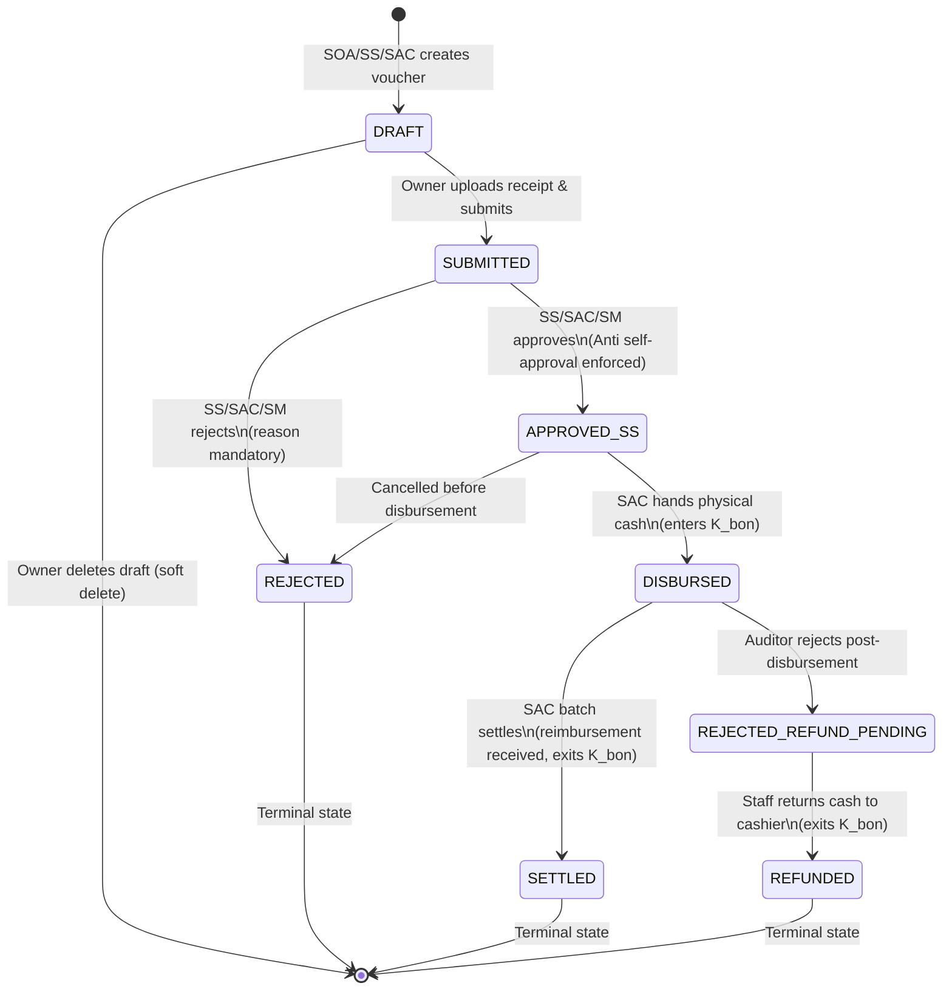
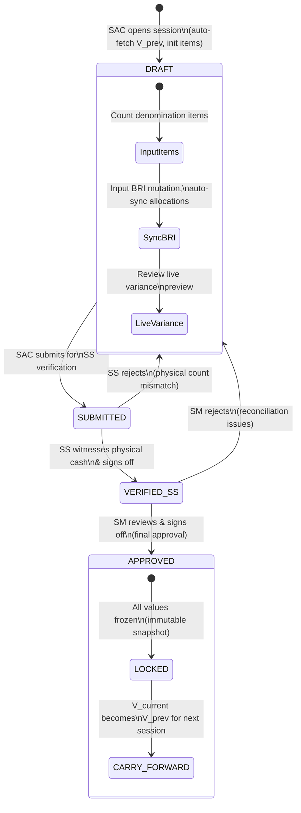
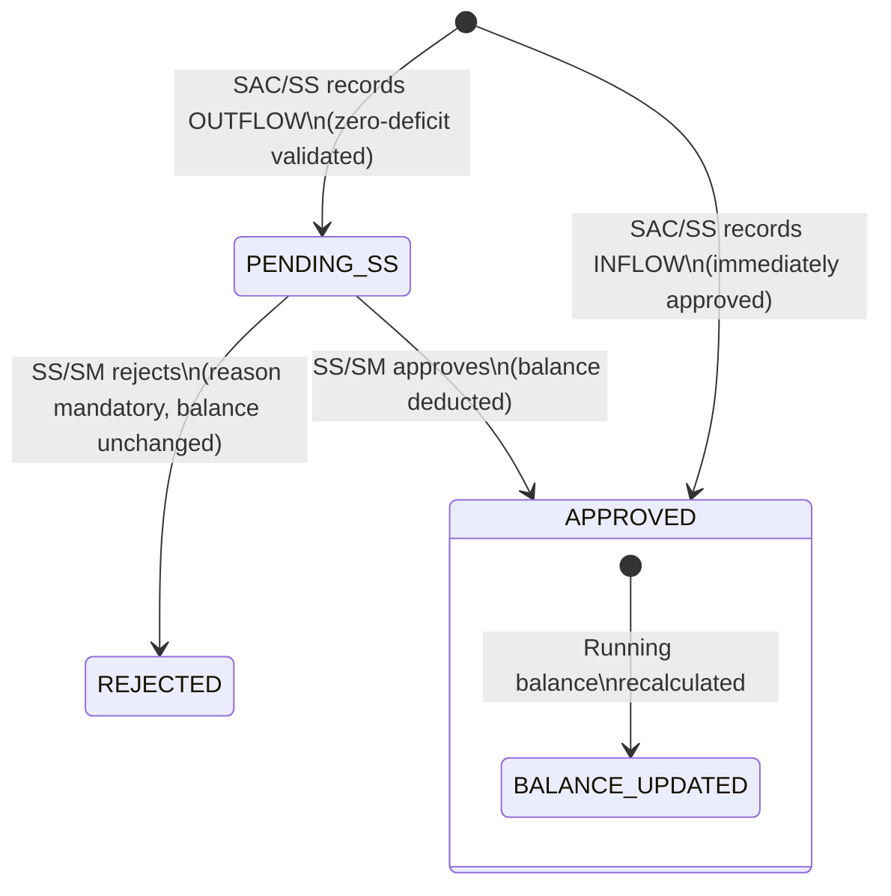
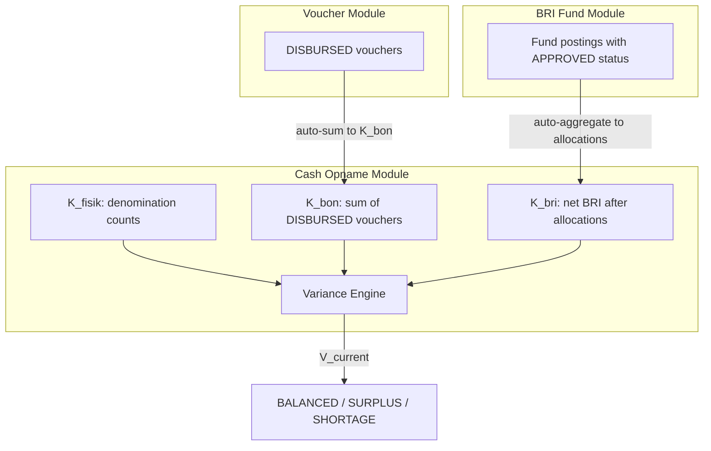

# 06 — Workflow & State Machine

## 1. Voucher Bon Kas Kecil Lifecycle

### Transition Table

| From | To | Actor | Conditions | Side Effects |
|---|---|---|---|---|
| - | DRAFT | SOA/SS/SAC | — | Generate voucher number |
| DRAFT | SUBMITTED | Owner | Receipt photo attached | Notify SS/SAC |
| DRAFT | (deleted) | Owner | Only own drafts | Soft delete |
| SUBMITTED | APPROVED_SS | SS/SAC/SM | Anti self-approval check | Notify SAC |
| SUBMITTED | REJECTED | SS/SAC/SM | Reason text required | Notify requester |
| APPROVED_SS | DISBURSED | SAC | — | Set disbursed_at, enters K_bon |
| APPROVED_SS | REJECTED | SAC/SM | — | Notify requester |
| DISBURSED | SETTLED | SAC | Batch operation | Set settled_at, exits K_bon |
| DISBURSED | REJECTED_REFUND_PENDING | SAC/SM | — | Staff must return cash |
| REJECTED_REFUND_PENDING | REFUNDED | SAC | Cash returned confirmed | Exits K_bon |

---

## 2. Cash Opname Session Lifecycle

### Transition Table

| From | To | Actor | Conditions | Side Effects |
|---|---|---|---|---|
| - | DRAFT | SAC | No existing active draft | Fetch V_prev, init items, populate BRI |
| DRAFT | SUBMITTED | SAC | All items inputted | Notify SS, lock draft temporarily |
| SUBMITTED | VERIFIED_SS | SS | Physical verification done | Set verified_by_ss, verified_ss_at |
| SUBMITTED | DRAFT | SS | Count mismatch | Reason text, unlock for SAC edit |
| VERIFIED_SS | APPROVED | SM | confirm_understanding = true | **LOCK ALL DATA**, set approved_sm_at, carry-forward V_current |
| VERIFIED_SS | DRAFT | SM | Reconciliation issues | Reason text, unlock for SAC edit |

---

## 3. BRI Fund Posting Lifecycle

### Transition Table

| From | To | Actor | Conditions | Side Effects |
|---|---|---|---|---|
| - | APPROVED | SAC/SS | type=INFLOW, proof attached | Running balance increases |
| - | PENDING_SS | SAC/SS | type=OUTFLOW, amount ≤ balance, proof attached | Notify SS/SM |
| PENDING_SS | APPROVED | SS/SM | Dual control (not creator) | Running balance decreases |
| PENDING_SS | REJECTED | SS/SM | Reason required | Balance unchanged |

---

## 4. Cross-Module Interactions

### Key Integration Points

1. **Voucher → Opname**: K_bon is the real-time sum of all DISBURSED vouchers for the current store. When a voucher is SETTLED or REFUNDED, K_bon decreases.

2. **BRI Postings → Opname**: BRI allocation values in the opname sub-ledger are computed from the aggregate running balances of all APPROVED fund postings, grouped by category.

3. **Opname Approval → Next Session**: When an opname is APPROVED, its V_current is atomically stored and will be read as V_prev by the next session.

4. **Opname Approval → Snapshot**: At approval time, system snapshots:
   - All denomination counts
   - All BRI allocation balances at that moment
   - All DISBURSED voucher IDs and amounts at that moment
   - These snapshots are stored in related tables and become immutable
