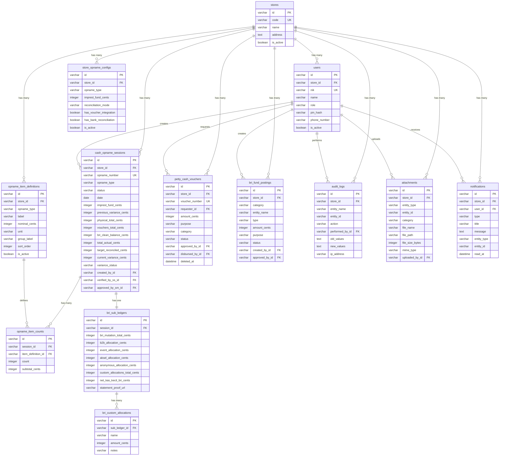

# 08 — Entity Relationship Diagram

## Full ERD

## Relationship Summary

| Parent | Child | Cardinality | On Delete |
|---|---|---|---|
| stores | users | 1:N | RESTRICT |
| stores | store_opname_configs | 1:N | CASCADE |
| stores | opname_item_definitions | 1:N | CASCADE |
| stores | cash_opname_sessions | 1:N | RESTRICT |
| stores | petty_cash_vouchers | 1:N | RESTRICT |
| stores | bri_fund_postings | 1:N | RESTRICT |
| cash_opname_sessions | opname_item_counts | 1:N | CASCADE |
| cash_opname_sessions | bri_sub_ledgers | 1:1 | CASCADE |
| opname_item_definitions | opname_item_counts | 1:N | RESTRICT |
| bri_sub_ledgers | bri_custom_allocations | 1:N | CASCADE |
| users | petty_cash_vouchers | 1:N (requester) | RESTRICT |
| users | cash_opname_sessions | 1:N (creator) | RESTRICT |
| users | bri_fund_postings | 1:N (creator) | RESTRICT |
| users | notifications | 1:N | CASCADE |
